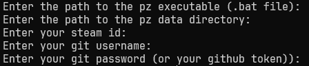
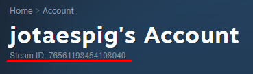

# Instructions and usage

First, download the latest release from the [releases page](https://github.com/JotaEspig/synced-pz-multiplayer-saves/releases).

## Install Git on your computer

You can download Git from the official website: [Git](https://git-scm.com/downloads)

Just install it with the default settings.

## Create an account on Github or Gitlab

You can create an account on Github or Gitlab, both are free.
But this tutorial will use Github.

Go to [Github](https://github.com) and create an account.

After creating your account, you should set the author name and email in Git using the terminal.
Open PowerShell (if you have no idea what PowerShell is, see
[https://learn.microsoft.com/en-us/powershell/scripting/windows-powershell/starting-windows-powershell?view=powershell-7.5#from-the-start-menu](https://learn.microsoft.com/en-us/powershell/scripting/windows-powershell/starting-windows-powershell?view=powershell-7.5#from-the-start-menu)) and type:

```bash
git config --global user.name "Your Name"
git config --global user.email "Your email that you used to create the github account"
```

## Setup the Synced PZ Multiplayer Saves program

(Everyone who wants to be a host needs to do this)

Create a folder and move the syncedpz.exe you downloaded from the releases page. For example, create a folder called "SyncedPZ" and move the syncedpz.exe there.

Double click the syncedpz.exe to run the program. It will create a folder called "data" in the same directory as the program. This folder stores database and synced server files.

First, the program will ask for your preferred language.

After this, the program will ask for some variables:



1. The first one is the path to the Project Zomboid .bat file. This is the file used
   for starting the game with Keep Syncing Mode (explained later). To get this path,
   go to the folder where Project Zomboid is installed and search for the
   ProjectZomboid64.bat file. Now get its path, including the filename with the
   extension (The way you do it depends on the Windows version, if you don't know
   how to do it, search online).
   Copy the path from the location field and paste it in the program.

2. The second one is the path to the Project Zomboid data folder.
   This is the folder where the game saves and config files are stored.
   Most likely, it is the folder under your user folder.
   For example, `C:\Users\YourUsername\Zomboid`.
   Copy the path from the location field and paste it in the program.

3. The third one is your Steam ID,
   to get it open Steam -> Click on your profile -> Account Details.
   Now you should see your Steam ID like in the image below:

    

    You just need to copy the number and paste it in the program.

4. The fourth one is the Git username you created when you created the Github account.

5. The fifth one is the password (access token in Github case).
   To create a token, go to
   [developer settings](https://https://github.com/settings/tokens)
   and click on "Generate new token" (choose the classic one).
   Give it a good name like "Project Zomboid Synced" and
   select the "repo" scope.
   Take notice of the expiration of the token,
   after that amount of time you will need to redo this step,
   but if you don't want to redo, just select "No expiration".
   And now, click on "Generate token",
   copy the token and place it on the program.

Now, you should be able to execute the program and see the menu options to see what you can do.

## Example of usage

Imagine a scenario where you and your friends want to play Project Zomboid together. You are the host, but you have to go to sleep. You can use this program to sync the save files with your friends, so they can host the game and continue playing.

### Steps to create a synced server

#### As the original host

1. Create a repository on github, using the account you just created.
   Go to [github](https://github.com) and click on "New" button on the top left corner.
   Give it a name like "ProjectZomboidSynced" and click on "Create repository".

2. Invite your friends as collaborators on the repository.
   Go to the repository page and click on "Settings" -> "Collaborators" -> "Add people".
   Invite your friends by their github usernames.
   Only your friends who want to play as hosts need to be collaborators.

3. Run the program and select the option "Add synced server".
   The program will show your local servers, choose the one you want to sync.
   After this, the program will ask for the repository URL.
   Copy the URL from the repository page and paste it in the program.
   Then the program will sync the server with the repository.

#### As a client (friend)

After being invited as a collaborator,
you should run the program and select the option "Clone synced server".
The program will ask for the repository URL.
Copy the URL from the repository page and paste it in the program.
Then the program will clone the server to your local machine.

Now, both the original host and the friend can host the game and play together. To visualize that, if you are the friend who's not the original host, open your game and click on Host, you will be able to see and select the synced server configs.

### Playing

It's recommended to play using the Keep Syncing Mode. This mode syncs every server at the start, every 5 minutes and when the game is closed.

To use this mode, run the program and select the option "Play". This will sync the server, open the game and start syncing every 5 minutes.

Now you are good to go! Just play the game and have fun with your friends.
